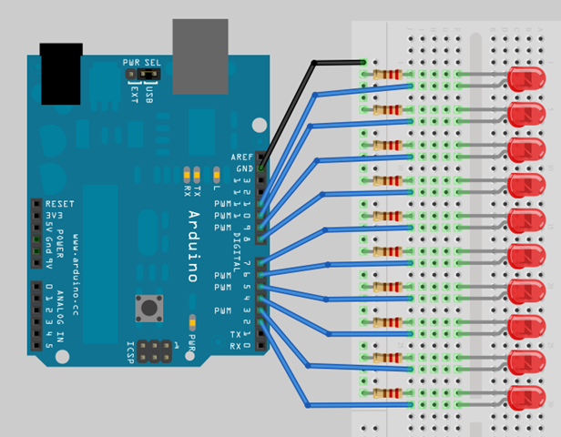

## Arduino入門教學(5) – 多顆 LED 的控制 (作者：Copper Maa)

### 實驗：Lab5 LED Bar Graph

控制 LED 燈排 (LED Bar Graph)，製作出類似「霹靂遊俠」影集中「夥計」車頭 LED 燈排的掃瞄效果。LED Bar Graph 適合當作電池電量或音量之類的指示燈，其外觀如下：

### 材料

麵包板 x 1
Arduino 主板 x 1
LED bar garph x 1 或是 LED x 10
220 ohm 電阻 x 10
單心線 x N
接線

把 LED bar graph 或 10 顆 LED 接到 pin2 到 pin11 腳 。LED 的接法為: 長腳(陽極)接到 pin 腳，短腳(陰極)串接一顆 220 ohm 電阻接到 GND

### 電路圖



### 程式碼: LEDBarGraph.pde

```CPP

// these constants won't change:
const int ledCount = 10;    // the number of LEDs in the bar graph

int ledPins[] = { 
  2, 3, 4, 5, 6, 7,8,9,10,11 };   // an array of pin numbers to which LEDs are attached

void setup() {
  // loop over the pin array and set them all to output:
  for (int thisLed = 0; thisLed < ledCount; thisLed++) {
    pinMode(ledPins[thisLed], OUTPUT); 
  }
}

void loop() {
  // loop over the LED array
  // Go from right to left
  for (int thisLed = 0; thisLed < ledCount; thisLed++) {
    digitalWrite(ledPins[thisLed], HIGH);
    delay(60);
    digitalWrite(ledPins[thisLed], LOW);
  }
  
  // And from left to right again
  for (int thisLed = ledCount -1 ; thisLed >= 0; thisLed--) {
    digitalWrite(ledPins[thisLed], HIGH);
    delay(60);
    
    if (thisLed == 0) {
      // 跑完一輪後&#65292;讓第一顆 LED 亮著暫停一下
      delay(200); 
    } else {
      digitalWrite(ledPins[thisLed], LOW);
    }
  } 
}

```

### 說明：

* L04: 宣告 ledPins 陣列並定義 LED bar 或 10 顆 LED 所在的腳位，在此使用 pin2 到 pin11 這 10 支腳位
* L17~L20: 讓 LED 產生掃瞄的效果，先由右往左
* L23~L33: 繼續讓 LED 產生掃瞄的效果，這次換成由左往右。跑完一輪後(先由右往左，再由左往右，這樣算一輪)，不關閉第一顆 LED 燈號，讓第一顆 LED 暫停一下

### 動動腦

接上一顆可變電阻，利用可變電阻來控制 LED bar graph。提醒：使用 analogRead() 讀進來的可變電阻數值介於 0 到 1023，程式的邏輯可以這樣寫：介於 0 – 99 就開第一顆 LED、介於 100 – 199 開第二顆 LED、介於 200 – 299 開第三顆…，也可以先利用 map() 函式將 0 到 1023 的數值對應為 0 到 9 之間的數值，然後再決定開哪些 LED。

### 範例照片／影片

* <http://www.youtube.com/watch?feature=player_embedded&v=WVo6byx7LK8>

### 延伸閱讀

* LED 10-bar array -- <http://www.sqlskills.com/blogs/paulselec/post/Arduino-projects-LED-10-bar-array.aspx>

【本文作者為馬萬圳，原文網址為： <http://coopermaa2nd.blogspot.tw/2010/12/arduino-lab5-led-bar-graph.html> ，由陳鍾誠編輯後納入本雜誌】
