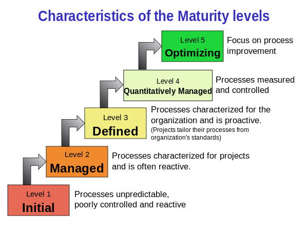

## 軟體工程討論 – CMMI、Agile 與Scrum

4 月 10 日的一個討論帖，引發了網友們關於軟體工程的熱烈討論，您可以在下列連結當中看該討論帖，瞭解更完整的訊息：

* <https://www.facebook.com/groups/programmerMagazine/permalink/627424190607634/>

經過這個討論，以及軟工專家 TML 的指點之後，我大致上歸納出了以下幾點心得：

1. CMMI 是 Capability Maturity Model Integration (能力成熟度整合模型) 的英文縮寫，感覺有點像資訊領域的 ISO 9001，規定了軟體公司需要撰寫哪些文件。
CMMI 的認證共有五種等級，分別是 (1). 啟動 (initial) (2). 已管理 (Managed) (3). 已定義 (Defined) (4). 已量化地管理 (Quantitively Managed) (5). 最佳化中 (Optimizing)，如下圖所示：

2. 而 Agile (敏捷軟體開發) 則是一種「軟體工程」的精神，主要強調「較短的開發循環」，以及「漸進式開發與交付」，也就是採用較為彈性的一種軟體工程方法，其價值觀如下：
    * 個人與互動 重於 流程與工具
    * 可用的軟體 重於 詳盡的文件
    * 與客戶合作 重於 合約協商
    * 回應變化 重於 遵循計劃

    在傳統的軟體工程分類上，通常將開發模式分類為「瀑布模式」與「螺旋模式」兩種，感覺上敏捷軟體開發有點像「螺旋模式」，但是強調的面向卻有所不同。

3. 敏捷開發既然是一種精神，於是根據這種精神衍生出了一大群軟體工程方法，其中較廣為人知的幾種是 Scrum 、「極限編程」(XP Extreme Programming)、
Lean Software Development、AUP（Agile Unified Process）等軟體工程方法。

根據 TML 的說法，CMMI 與敏捷開發並不會互相衝突，CMMI 沒有強調工法，只要求最適合工法(process)，所以瀑布式是工法，agile 也是工法。至於 CMMI 的重點是記錄下工法的過程，如果好下次要沿用，不好下次改進，CMMI 是一個 process improvement 的框架！

很多 CMMI level 5 的公司也有引進 scrum 甚至 pair programming 等等當做其中的一個 process，因此兩者並不會互相衝突，舉例而言： PMI-Agile 的作法
就非常的嚴謹，而 Scrum 也在很多大公司被採用，Agile 絕對不是一種隨便修改軟體規格的方法。

### 參考文獻
* [維基百科:敏捷軟體開發](http://zh.wikipedia.org/wiki/%E6%95%8F%E6%8D%B7%E8%BD%AF%E4%BB%B6%E5%BC%80%E5%8F%91)
* [維基百科:极限编程](http://zh.wikipedia.org/wiki/%E6%9E%81%E9%99%90%E7%BC%96%E7%A8%8B)
* [維基百科:Scrum](http://zh.wikipedia.org/zh-hant/Scrum)

以下是 TML 所提供的一些參考資料，

* [軟體工程與CMMI](http://www.gss.com.tw/index.php/eis/239)
* [CMMI - MBA智库百科](http://wiki.mbalib.com/zh-tw/CMMI)
* [敏捷社区的所有内容](http://www.infoq.com/cn/agile)
* [軟體工程:持續整合 (Continuous integration, CI) 簡介 - In 91- 點部落](http://www.dotblogs.com.tw/hatelove/archive/2011/12/25/introducing-continuous-integration.aspx)
* [Continuous Integration 【持續整合】與 Nightly Build【每日建置】+ Hudson 介紹 « Soul & Shell Blog](http://blog.toright.com/archives/600)
