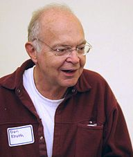

## 大師風采 – Donald Ervin Knuth

如果您上過「資料結構」這門課，您可能會知道 B-Tree 這個多元樹結構，如果您修過「演算法」，您可能會聽過「Knuth–Morris–Pratt」這個字串搜尋演算法，
如果您修過編譯器，應該會知道 LR(K) 這類的語法剖析器，

如果您修過離散數學，您可能會知道有本書叫作「具體數學」(Concrete Mathematics)，事實上常被用來當離散數學的教科書。
為甚麼叫 Concrete Mathematics 呢？原因是 CONtinuous + disCRETE = CONCRETE，也就是「連續+離散數學=具體數學」。

如果您寫過論文，您可能會用過 LaTex、MikTex、或者用 LibreOffice 中的 TexMath 來寫數學式，甚至如果您寫過維基百科、或常用維基的方式寫網頁、
或者用過 pandoc 等軟體寫 markdown 格式的文章，您也可能會用 Tex 的格式來寫數學式。

以上這些事情，都與 Donald Ervin Knuth 有密切關連，這位生於 1938 年的著名電腦科學家，除了發明無數著名的演算法與資料結構之外，他還
發明了 LaTex 這個軟體，這個軟體直到現在都還有眾多的使用者，而其中的數學式之寫法，仍然在許多新的出版軟體裏被採用著。



筆者也是 Tex 數學式的愛用者，從 2007 年開始用 wikidot 以來就常用 Tex 寫數學式，之後用 LibreOffice 還是習慣安裝 TexMath 來寫 Tex，現在
用 markdown 寫書還是用 Tex 寫數學式，這都得感謝 Knuth (我可不希望用 MathML 寫數學式，因為真的會打到手斷掉！)。

(奇怪的是我念碩博士的時候從來沒想過要用 Tex 寫數學式，而是用 Word 的方程式編輯器，而且那時還不太會用 Word 的自動目錄，
論文的排版實在爛得可以，這樣居然也順利畢業了，真是僥倖。 -- 不過我的疑問是，學校怎麼從來沒人提過有「自動目錄」這件事啊？
這不是研究生最應該學會的一件簡單事情嗎？冏！)

另外、Knuth 最為人稱道的，是他所寫的一部鉅著，總共預計出版七大冊的「The Art of Computer Programming」(事實上到目前為止只出到第四冊)， 稍微能看完其中一兩章的話，您就會對 Knuth 的邏輯頭腦感到非常驚訝。以下是該書的各冊標題與章節，您應該可以從中看出 Knuth 所涉略的領域。

```
第一冊 - 基礎演算法（Fundamental Algorithms）
  第一章 - 基本觀念（Basic concepts）
  第二章 - 資訊結構（Information structures）
第二冊 - 半數值演算法（Seminumerical Algorithms）
  第三章 - 隨機數（Random numbers）
  第四章 - 算數（Arithmetic）
第三冊 - 排序與搜尋（Sorting and Searching）
  第五章 - 排序（Sorting）
  第六章 - 搜尋（Searching）
第四冊 - 組合演算法 (Combinatorial Algorithms),準備中(至2009年4月已出版五個分冊),測試版本已上載到Knuth's的網站).
  第4A卷, 列舉與回溯（Enumeration and Backtracking）
    第七章 - 組合的搜尋（Combinatorial searching）
  第4B卷, 圖形與網路演算法（Graph and Network Algorithms）
    第七章續（continued）
  第4C及4D(可能)卷, 最佳化與遞歸（Optimization and Recursion）
    第七章續（continued）
  第八章 - 遞歸（Recursion）
第五冊 - 造句演算法（Syntactic Algorithms）, 計劃中(預計2020年完成).
  第九章 - 語句掃瞄（Lexical scanning）
  第十章 - 剖析技術（Parsing techniques）
第六冊 - 與上下文無關語言理論（Theory of Context-Free Languages）, 計劃中
第七冊 - 編譯器技術（Compiler Techniques）,計劃中
```

### 參考文獻
* [Donald E. Knuth 在史丹佛的網站](http://www-cs-faculty.stanford.edu/~uno/)
* [Wikipedia:Knuth](http://en.wikipedia.org/wiki/Donald_Knuth)
* [維基百科:Knuth](https://zh.wikipedia.org/wiki/%E9%AB%98%E5%BE%B7%E7%BA%B3)
* [教授还是程序员？- Donald Knuth访谈录](http://blog.sciencenet.cn/blog-61674-33964.html)
* [解读高德纳（Donald E.Knuth） : 最伟大的计算机程序员是如何诞生的？](http://9yls.net/17931.html)
* [維基百科:電腦程式設計藝術](https://zh.wikipedia.org/wiki/%E8%AE%A1%E7%AE%97%E6%9C%BA%E7%A8%8B%E5%BA%8F%E8%AE%BE%E8%AE%A1%E8%89%BA%E6%9C%AF)
* [LibreOffice:TexMath 插件](http://extensions.libreoffice.org/extension-center/texmaths-1)

【本文由陳鍾誠取材並修改自維基百科】


